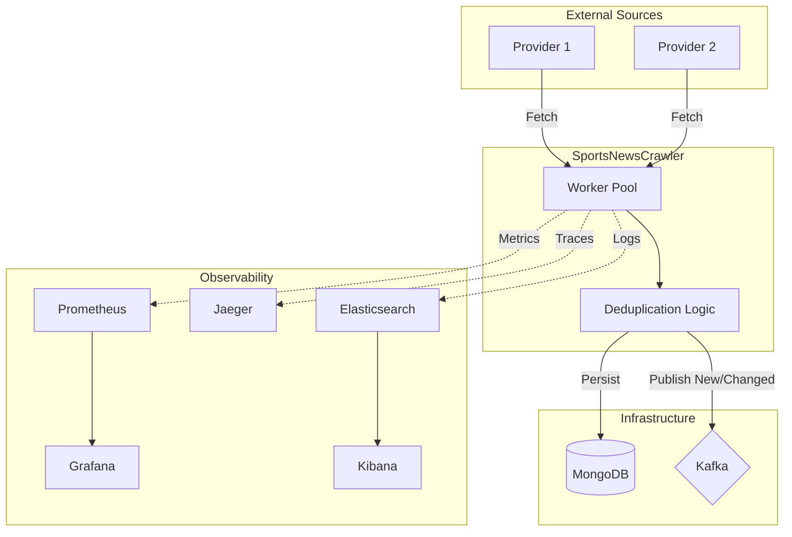

# Sports News Crawler

A scalable, high-performance microservice designed to crawl, normalize, and distribute sports news articles from multiple external providers. Built with **Go** using **Hexagonal Architecture (Ports and Adapters)**, this project emphasizes observability, reliability, and maintainability.

## 🚀 Overview

The Sports News Crawler automates the ingestion of news content. It fetches articles from configured providers, deduplicates them based on content hashing, persists them to MongoDB, and publishes new or updated articles to a Kafka topic for downstream consumption (e.g., by a CMS or notification service).



### Key Features

*   **Multi-Provider Support**: Concurrent crawling of multiple news sources using a worker pool pattern.
*   **Smart Deduplication**: Uses SHA-256 content hashing to detect duplicate articles and only process actual content changes.
*   **Hexagonal Architecture**: Clear separation of concerns between Domain (business logic), Application (orchestration), and Infrastructure (adapters).
*   **Observability First**:
    *   **Metrics**: Prometheus integration for tracking ingestion rates, errors, and latencies.
    *   **Tracing**: OpenTelemetry auto-instrumented tracing with Jaeger for visualizing requests spans.
    *   **Logs**: Structured JSON logging routed to Elasticsearch and visualized in Kibana.
    *   **Dashboards**: Pre-provisioned Grafana dashboards.
*   **Resilience**: Graceful shutdown, context-aware cancellation, and timeout management.
*   **Containerized**: Fully Docker-ized environment with Docker Compose for local development and Kubernetes manifests for deployment.

## 🛠 Tech Stack

*   **Language**: Go 1.24+
*   **Storage**: MongoDB
*   **Messaging**: Kafka (with Zookeeper)
*   **Observability**: Prometheus, Grafana, Jaeger, Elasticsearch, Kibana (EFK Stack)
*   **Infrastructure**: Docker, Kubernetes (Manifests included)

## 🏁 Getting Started

### Prerequisites

*   [Go](https://go.dev/dl/) 1.24 or higher
*   [Docker](https://www.docker.com/) and Docker Compose
*   [Make](https://www.gnu.org/software/make/)

### Installation

1.  **Clone the repository:**
    ```bash
    git clone https://github.com/SportsNewsCrawler/SportsNewsCrawler.git
    cd SportsNewsCrawler
    ```

2.  **Initialize Environment:**
    Create the `.env` file from the example.
    ```bash
    make init-env
    ```

3.  **Install Dependencies:**
    ```bash
    make install
    ```

### Running Locally

The easiest way to run the entire stack (App, DB, Kafka, Observability tools) is via Docker Compose.

```bash
make dev
```

This command will start:
*   **App**: `http://localhost:8080`
*   **Mock Feed**: `http://localhost:8081` (Simulates external providers)
*   **Prometheus**: `http://localhost:9090`
*   **Grafana**: `http://localhost:3000` (User: `admin`, Pass: `admin`)
*   **Jaeger**: `http://localhost:16686`
*   **Kibana**: `http://localhost:5601`

To stop the environment:
```bash
make dev-down
```

### Running Tests

```bash
# Run unit tests
make test

# Run tests with race detection
make test-race

# Run linter
make lint
```

## 📂 Project Structure

This project follows the **Standard Go Project Layout** and **Hexagonal Architecture**.

```text
.
├── cmd/
│   ├── server/          # Main entry point for the crawler service
│   └── mock-feed/       # Mock server to simulate external news providers
├── config/              # Configuration files (Grafana dashboards, Prometheus, etc.)
├── internal/
│   ├── domain/          # Enterprise business logic (Entities, Interfaces) - Pure Go, no deps
│   ├── app/             # Application business logic (Services, Use Cases)
│   └── infra/           # Infrastructure adapters (MongoDB, Kafka, HTTP Clients)
├── pkg/                 # Public libraries (if any)
├── scripts/             # Utility scripts (e.g., Kibana setup)
├── Makefile             # Build and management commands
└── docker-compose.yml   # Local development stack definition
```

## ⚙️ Configuration

The application is configured via environment variables. See `.env.example` for defaults.

| Variable | Description | Default |
|----------|-------------|---------|
| `PORT` | HTTP Server Port | `8080` |
| `LOG_LEVEL` | Logging Level (debug, info, warn, error) | `info` |
| `MONGO_URI` | MongoDB Connection String | `mongodb://localhost:27017` |
| `KAFKA_BROKERS` | Kafka Broker addresses | `localhost:9092` |
| `CRAWL_INTERVAL` | Duration between crawls | `2m` |

## 📊 Observability

### Metrics (Prometheus & Grafana)
The application exposes Prometheus metrics at `/metrics`.
*   **Business Metrics**: `articles_ingested_total`, `articles_duplicates_skipped_total`.
*   **Runtime Metrics**: Go routines, GC duration, memory usage.

Access **Grafana** at http://localhost:3000 to view the "Sports News Crawler" dashboard.

### Tracing (Jaeger)
Distributed tracing is implemented using OpenTelemetry.
Access **Jaeger UI** at http://localhost:16686 to trace `processProvider` execution flows and debug latencies.

### Logs (Elasticsearch & Kibana)
Logs are written in JSON format and shipped to Elasticsearch via Filebeat (in Docker) or standard output (in K8s).
Access **Kibana** at http://localhost:5601 to search and analyze logs.

## 🚀 Deployment

### Docker
Build the Docker image:
```bash
make docker-build
```


## ⚖️ Design Decisions & Trade-offs

*   **Deduplication Strategy**: We generate a SHA-256 hash of the article's core content (Title, Body, Source, URL) to detect changes. This allows us to update existing articles if their content changes while ignoring redundant fetches, verifying data integrity without complex database lookups.
*   **Dual-Write Potential**: Currently, the service writes to MongoDB and then publishes to Kafka. In a partial failure scenario (DB success, Kafka fail), there could be inconsistency. A future improvement would be implementing the **Transactional Outbox Pattern** to guarantee specific eventual consistency.
*   **Concurrency**: A worker pool model is used to limit the number of concurrent processing routines, protecting system resources while allowing multiple providers to be crawled in parallel.

## 🗺️ Roadmap

*   [ ] **Kubernetes Deployment**: Create `k8s/` manifests (Deployment, Service, ConfigMap) to fully utilize the existing `Makefile` targets.
*   [ ] **Dynamic Configuration**: Move provider config to a database/API to allow adding sources without restarts.
*   [ ] **Rate Limiting**: Implement per-domain rate limiting to respect provider `robots.txt` and API limits.
*   [ ] **Dead Letter Queue (DLQ)**: Automated replay mechanisms for failed message publishing.
*   [ ] **Authentication**: Add API key or OAuth middleware for the admin endpoints.
