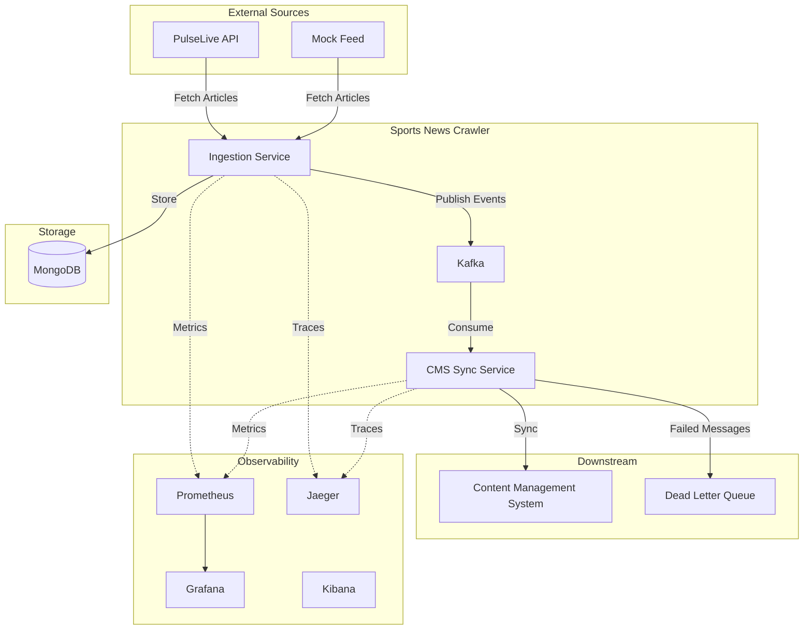
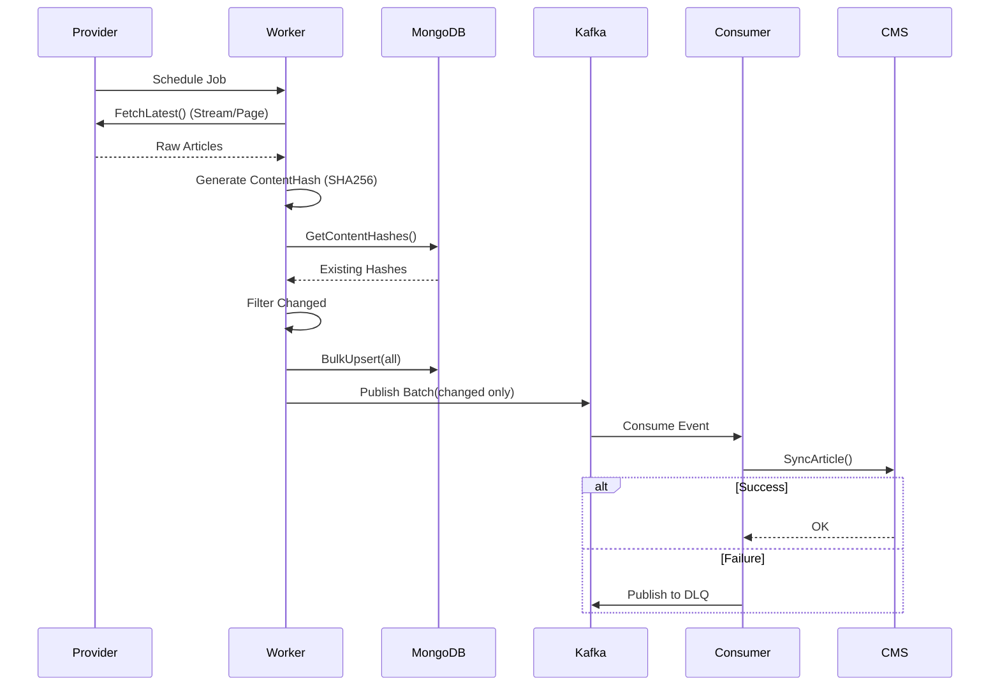

# Sports News Crawler

A production-ready microservice for ingesting, normalizing, and distributing sports news articles from multiple sources using event-driven architecture.

## Table of Contents

- [Overview](#overview)
- [Architecture](#architecture)
- [Design Decisions & Trade-offs](#design-decisions--trade-offs)
- [Project Structure](#project-structure)
- [Features](#features)
- [Getting Started](#getting-started)
- [Configuration](#configuration)
- [Observability](#observability)
- [Deployment](#deployment)

## Overview

The Sports News Crawler is a scalable microservice that:
- **Ingests** articles from multiple sports news providers (PulseLive, custom feeds)
- **Normalizes** data into a unified schema
- **Deduplicates** content using SHA256 hashing
- **Publishes** events to Kafka for downstream consumers
- **Syncs** articles to a CMS via event-driven processing
- **Monitors** system health with Prometheus metrics and Jaeger tracing

## Architecture

### System Context



### Data Flow



## Design Decisions & Trade-offs

### 1. Hexagonal Architecture
**Decision**: We use a strict Hexagonal (Ports & Adapters) architecture, separating `domain`, `app` (application logic), and `infra` (adapters).
*   **Why**: Ensures the core business logic is independent of external tools (MongoDB, Kafka). It makes testing easier by allowing simple mocks for all interfaces.
*   **Trade-off**: Adds boilerplate (interfaces, DTOs, factories) compared to a layered architecture, but pays off in maintainability for complex systems.

### 2. Event-Driven Architecture (Kafka)
**Decision**: Decouple ingestion from CMS synchronization using Kafka.
*   **Why**: Allows the ingestion layer to scale independently from the CMS. If the CMS goes down, we don't lose data; events just queue up.
*   **Trade-off**: Managing Kafka introduces infrastructure complexity and eventual consistency. Immediate "read-after-write" is not guaranteed.

### 3. Content-Based Deduplication (SHA256)
**Decision**: Use a SHA256 hash of the article's core content (Title, Body, Summary) to detect changes.
*   **Why**: Timestamp-based checks are unreliable (many APIs don't verify "updated_at" correctly). Hashing ensures we only process *meaningful* changes.
*   **Trade-off**: Hashing consumes CPU cycles. We migrated to a batch processing model (fetch 100 -> hash 100 -> upsert 100) to mitigate this.

### 4. Polling vs. Streaming
**Decision**: The `GenericProvider` supports both single-page fetching and multi-page streaming (recursively following pagination).
*   **Why**: Some sources give us everything in one go, others need deep crawling.
*   **Trade-off**: Complex state management in the provider (`PageInfo` tracking). We added a `maxSafetyPages` limit to prevent infinite loops on broken APIs.

### 5. MongoDB for Storage
**Decision**: Use MongoDB for storing raw content.
*   **Why**: Flexible schema allowing us to ingest varied fields from different providers without strict schema migrations.
*   **Trade-off**: No ACID transactions across collections (though we only need single-document atomicity for upserts).

## Project Structure

```
SportsNewsCrawler/
├── cmd/                  # Entry points
├── internal/
│   ├── domain/           # Entities & Interfaces (Pure Go, no deps)
│   ├── app/              # Use Cases (Service implementations)
│   ├── infra/            # Adapters (MongoDB, Kafka, PulseLive, HTTP)
│   └── transport/        # Port (HTTP Server)
├── pkg/                  # Shared libraries
│   ├── config/           # Configuration management
│   └── logging/          # Shared logging utilities
├── config/               # Configuration files
├── k8s/                  # Kubernetes manifests
└── scripts/              # Helper scripts
```

## Features

- **Multi-Source Ingestion**: Configurable providers (PulseLive + Mock).
- **Deduplication**: Intelligent batch processing to ignore duplicates.
- **Resilience**: Circuit Breakers on external APIs, DLQ for broken syncs.
- **Observability**: RED Method (Rate, Errors, Duration) dashboards.
- **Production Ready**: Multi-stage Docker builds, Graceful Shutdown, Helm-ready manifests.

## Getting Started

### Prerequisites
- Docker & Docker Compose
- Go 1.24+

### Quick Start
1.  **Start Services**:
    ```bash
    make init-env
    make dev
    ```
2.  **Verify**:
    ```bash
    make health
    ```

## Configuration

Configuration is managed via `.env` (infrastructure) and `sources.json` (business logic).

| Variable | Description | Default |
|----------|-------------|---------|
| `MONGO_URI` | Database Connection | `mongodb://mongodb:27017` |
| `KAFKA_BROKERS` | Kafka Cluster | `kafka:29092` |
| `POLL_INTERVAL` | How often to check sources | `1m` |
| `BATCH_SIZE` | Articles per provider fetch | `20` |

## Observability

The stack includes Prometheus, Grafana, Jaeger, and ELK (Filebeat/Kibana).

### 1. Monitoring Routine (Grafana)
**Access**: [http://localhost:3000](http://localhost:3000) (admin/admin)

The pre-configured dashboard "Sports News Crawler - Overview" tracks the **RED Method** (Rate, Errors, Duration):
*   **Ingestion Rate (Rate)**: Articles processed per minute. A drop indicates source issues.
*   **Error Rate (Errors)**: Spikes here indicate API failures or parsing issues.
*   **Fetch Duration (Duration)**: Response times (p95) from external providers.

**Key Metrics to Watch**:
*   **Duplicate Rate**: A high duplicate rate is **GOOD**. It means the deduplication logic is working and we aren't spamming downstream.
*   **Active Workers**: If this consistently hits the limit (default 5), increase `WORKER_POOL_SIZE`.

### 2. Deep Dive: Logs (Kibana / JSON)
**Access**: [http://localhost:5601](http://localhost:5601)

Logs are structured in JSON for easy parsing.
```bash
# View live logs via CLI
docker-compose logs -f app | jq
```

**JSON Structure**:
```json
{
  "level": "ERROR",
  "msg": "Crawl failed",
  "provider": "pulselive",
  "trace_id": "12345abcdef",
  "error": "http timeout"
}
```

**How to get the most out of logs**:
*   **Filter by Level**: Focus on `ERROR` to find immediate problems.
*   **Correlate with Traces**: Copy the `trace_id` from a log entries and paste it into Jaeger to see exactly what happened during that request.

### 3. Deep Dive: Traces (Jaeger)
**Access**: [http://localhost:16686](http://localhost:16686)

Jaeger visualizes the entire lifespan of a request (or background job).

**How to use Tracing**:
*   **Identify Bottlenecks**: Long bars in the trace view show where time is spent.
    *   *Long "HTTP GET"* = Slow external provider.
    *   *Long "Mongo Find"* = DB index issue or load.
*   **Error Root Cause**: Red spans indicate failure. Click them to see exactly which component (Provider, DB, or Kafka) failed.

### 4. Alerting (Prometheus)
**Access**: [http://localhost:9090](http://localhost:9090)

Common PromQL queries for debugging:
*   `rate(articles_ingested_total[5m])`: Current ingestion speed.
*   `sum(increase(dlq_messages_published_total[1h]))`: Number of failed syncs in the last hour.

## License
MIT
