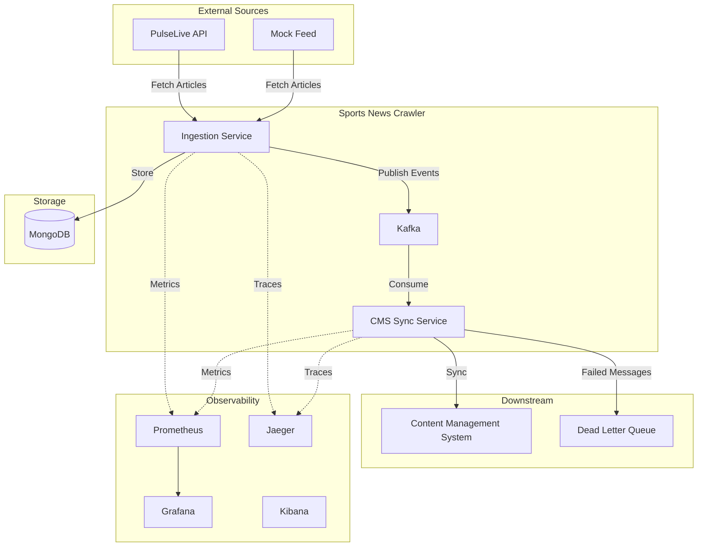
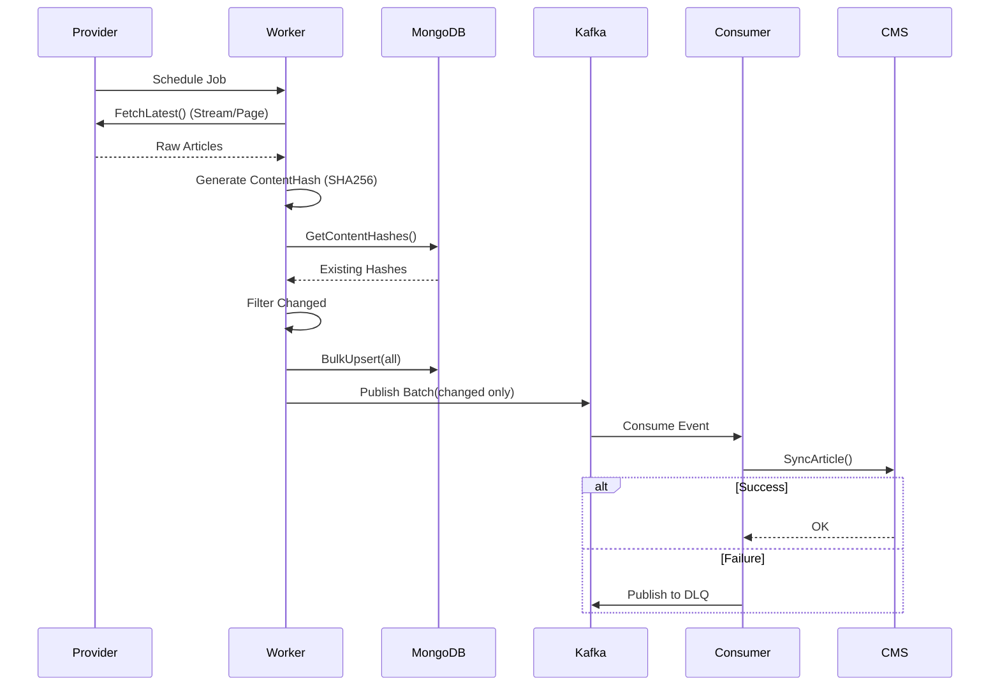

# Sports News Crawler

A production-ready microservice for ingesting, normalizing, and distributing sports news articles from multiple sources using event-driven architecture.

## Table of Contents

- [Overview](#overview)
- [Architecture](#architecture)
- [System Walkthrough](#system-walkthrough)
- [Design Decisions & Trade-offs](#design-decisions--trade-offs)
- [Project Structure](#project-structure)
- [Features](#features)
- [Getting Started](#getting-started)
- [Configuration](#configuration)
- [Observability](#observability)

## Overview

The Sports News Crawler is a scalable microservice that:
- **Ingests** articles from multiple sports news providers (PulseLive, custom feeds)
- **Normalizes** data into a unified schema
- **Deduplicates** content using SHA256 hashing to prevent spamming downstream systems
- **Publishes** events to Kafka for downstream consumers
- **Syncs** articles to a CMS via event-driven processing
- **Monitors** system health with Prometheus metrics and Jaeger tracing

## Architecture

### System Context



### Data Flow



## System Walkthrough: The Life of an Article

To understand the system, let's follow the journey of a news article from a provider to the CMS.

### 1. The Tick (Ingestion)
The `NewsCrawlerService` runs a background **Worker Pool**. Every `POLL_INTERVAL` (default 1m), a job is scheduled for each configured provider (e.g., PulseLive, Mock).
- **Concurrency**: A `sync.Map` ensures only one crawl job per provider runs at a time. If a provider is slow, we skip the next tick to prevent cascading failures.

### 2. The Fetch (Provider)
The specific `Provider` adapter (e.g., `PulseLiveProvider`) connects to the external API.
- **Streaming/Pagination**: It doesn't just grab the front page. It recursively follows pagination (up to `maxSafetyPages`) until it reaches articles that haven't been updated recently.
- **Normalization**: Raw JSON is transformed into our domain `Article` struct.

### 3. The Deduplication (Core Logic)
This is the most critical step. We don't want to spam the CMS with "updates" if nothing changed.
- **Hashing**: We calculate a SHA256 `ContentHash` of critical fields: `Title + Body + Summary + Source + URL`.
- **Comparison**: We query MongoDB for existing hashes of these IDs.
    - **New ID?** -> Process as `Article New`.
    - **Existing ID & Hash Mismatch?** -> Process as `Article Changed` (content updated).
    - **Existing ID & Hash Match?** -> Ignore (Duplicate).

### 4. The Persist & Publish
- **Bulk Upsert**: All articles (even unchanged ones) are upserted to MongoDB to update their `fetched_at` timestamp.
- **Event Publishing**: Only `Article New` or `Article Changed` trigger a Kafka event. This decoupling allows the DB to happen synchronously while the "notification" is async.

### 5. The Sync (Consumer)
A separate `CMSSyncService` listens to the Kafka topic.
- **Decoupling**: If the CMS is down, the crawler acts as a buffer. Events pile up in Kafka.
- **Retry/DLQ**: If the CMS rejects an article (5xx error), we verify the error type. Persistent errors send the message to a **Dead Letter Queue (DLQ)** for manual inspection, preventing head-of-line blocking.

## Design Decisions & Trade-offs

### 1. Hexagonal Architecture (Ports & Adapters)
**Decision**: Strict separation of changes. `internal/domain` has NO dependencies. `internal/app` orchestrates. `internal/infra` implements interfaces.
*   **Why**: Makes unit testing trivial (just mock the interface). Allows switching infrastructure (e.g., Postgres instead of Mongo) without touching business logic.

### 2. Testcontainers for Integration Testing
**Decision**: Use `testcontainers-go` to spin up real MongoDB instances for tests.
*   **Why**: Mocks can lie. Testing against a real ephemeral database ensures our BSON tags, unique constraints, and query logic work in reality.

### 3. Content-Based Hashing
**Decision**: SHA256 hash of content fields.
*   **Why**: "LastUpdated" timestamps from external APIs are often unreliable or missing. Hashing is the only ground truth for "has content changed?".

## Project Structure

We follow the standard Go project layout:

```
SportsNewsCrawler/
├── cmd/                  # Main applications
│   ├── server/           # Main Crawler + Sync Service
│   └── mock-feed/        # Testing tool to generate fake news
├── internal/             # Private application code
│   ├── domain/           # Core Logic (Entities, Interfaces) - PURE GO
│   ├── app/              # Application Business Logic (Services)
│   ├── infra/            # Adapters (Mongo, Kafka, HTTP Clients)
│   └── transport/        # Port adapters (HTTP Server)
├── pkg/                  # Public shared libraries (OK for external import)
│   ├── config/           # Configuration structs
│   └── logging/          # Slog setup
└── k8s/                  # Kubernetes Deployment Manifests
```

## Features

- **Multi-Source Ingestion**: Configurable providers.
- **Smart Deduplication**: content-hash based.
- **Dead Letter Queue (DLQ)**: Robust error handling for events.
- **Observability**: RED Method (Rate, Errors, Duration) dashboards.
- **Production Ready**: Graceful Shutdown, Health Checks, Structured Logging.

## Getting Started

### Prerequisites
- Docker & Docker Compose
- Go 1.24+

### Quick Start
1.  **Initialize Environment**:
    ```bash
    make init-env
    ```
2.  **Start Everything (Dev Mode)**:
    ```bash
    make dev
    ```
    This spins up: Mongo, Kafka, Zookeeper, Prometheus, Grafana, Jaeger, Kibana, Mock-Feed, and the Crawler.

3.  **Verify**:
    ```bash
    make health
    # Output: {"status":"ok",...}
    ```

### Testing
We use a robust test suite:
- **Unit Tests**: Fast, mock-based.
- **Integration Tests**: Slow, Docker-based (Testcontainers).
```bash
make check  # Runs fmt, vet, lint, and ALL tests
```

## Configuration

Managed via `.env` (infra) and `sources.json` (providers).

## Observability

### Dashboard Access
- **Grafana**: `http://localhost:3000` (admin/admin) - **Visual Metrics**
- **Jaeger**: `http://localhost:16686` - **Distributed Traces**
- **Kibana**: `http://localhost:5601` - **Structured Logs**
- **Prometheus**: `http://localhost:9090` - **Raw Metrics**

See usage dashboards in Grafana for:
- **Ingestion Rate** (Articles/min)
- **Duplicate Skipped Count** (Efficiency metric)
- **Crawl Duration** (p95 latency)

## License
MIT
